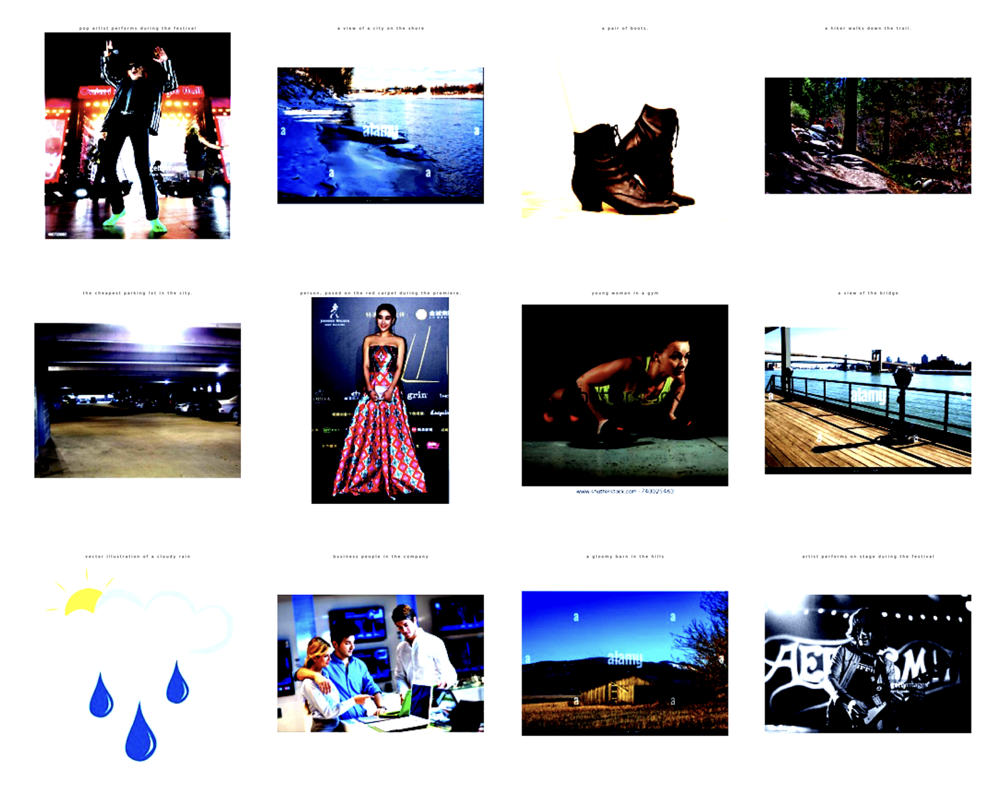

# Loracap: Empowering Unimodal ViT and LM for Image Captioning

- This simple framework takes patch embeddings of a pretrained CLIP-ViT, applys attention pooling and feeds these pooled tokens to the FLAN-T5 text decoder cross-attention.
- LoRA is applied to the text decoder, so the learnable parameters come from either the attention pooler or the low-rank matrices (which is very small in size).
- The model is trained on a subset (10%) of CC3M dataset, and simple lr scheduling is employed to stablize training.
- The model demonstrates decent performance after 2-3 epochs, which takes about 2-3 hours (not accurate) on a single A100 GPU.
- Here I display random images from CC3M validation set and the generated captions. You might want to zoom in to read the sentences (sorry for your inconvenience).




- `train.py` is the file to train the model and log/visualize on the way. Simply running 

```bash
$ python train.py --dataset /path/to/your/dataset --val_dataset /path/to/val/dataset
```

suffice for default hyperparameter setups. There are HPs that you can choose from the command line, such as lr, batch size and gpu-id. <br><br>

- `main.py` is the legacy script that used to serve similar purpose to `train.py` but is currently dismissed.
